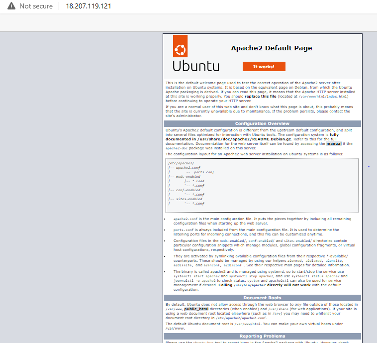

# Project 1

`sudo apt update`    ran sudo apt update command

`sudo apt install apache2`  installed apache2, on completion I got the message the kernel version should be updated to the most recent, though I did not capture the error message. However, I did grab the screenshot before the system would be restarted

After clicking enter, I got the following

Confirming Apache is running on the server

`sudo systemctl status apache2` *VIOLA Apache is running*

This line ending with 1 - 15/15 (END) appeared as an issue but entering *Q* solved it.

I set up the outbound traffic on my AWS instance to any and ran the curl commands below:

*curl http://localhost:80*

Then I checked to confirm my web server installed and accessible, below is the confirmation page:

used ‘apt’ to acquire and install this software with:

`sudo apt install mysql-server`

Got an alert for pending kernel upgrade so I did.

Installed php and confirmed version

I restarted my instance to ensure kernel is upgraded per the message I received earlier.

I created *projectlamp* with `sudo mkdir /var/www/projectlamp` command

completed project lamp and confirmed the html page loaded.

I enabled php and changed the website form defaulting to html and set up php as its default

`sudo vim /etc/apache2/mods-enabled/dir.conf`

Reloaded apache `sudo systemctl reload apache2`

and used this command to create a new php index file `vim /var/www/projectlamp/index.php` 

The following loaded after refreshing the web page:

Summary
Project 1 completed with the following:
1. installing apache and updated the firewall
2. installed MySql and Php
3. Created virtual host for website using apache and enabled php on the website changing it from default html.

The major challenge I experienced was installing the projectlamp.conf

I got the error below several times before I edited with E

